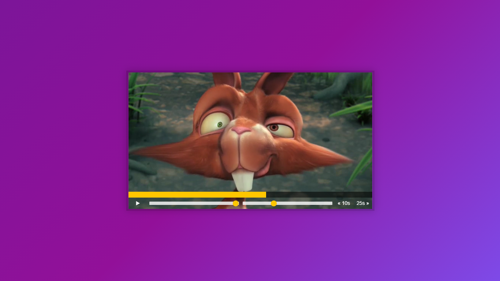

# JS-30-DAY-11

<h1 align="center"> Custom HTML5 Video Player  </h1>

##[demo](https://cenacrharsh.github.io/JS-30-DAY-11/)

##Lessons Learned:

- Made a custom video player in html5 and added a lot of media buttons and features using javascript.
- grasped the concepts of properties related to video/audio files.
